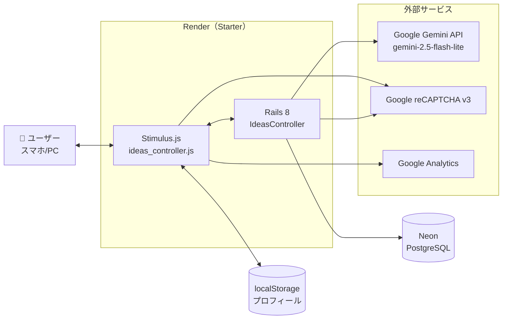
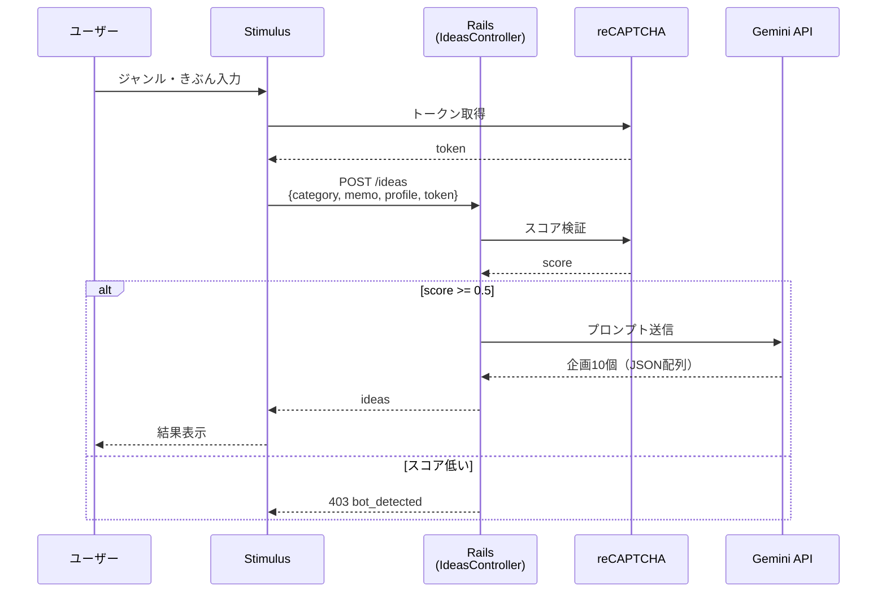
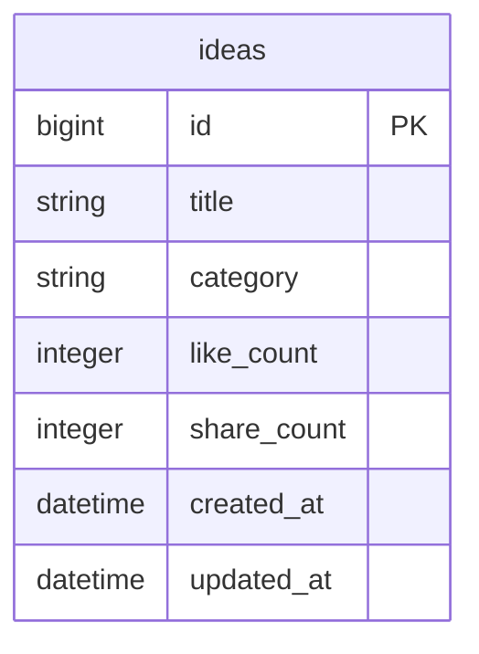

# きかくさん

REALITYライバーのための配信企画ジェネレータ。ジャンルと今日のきぶんから、AIが配信企画を10個提案する。

🔗 https://kikakusan.onrender.com/

個人開発 ― 企画・設計・実装・テスト・デプロイ・運用まで1人。

---

## なぜ作ったか

著者自身、ライブ配信アプリで数ヶ月ライバー活動をしていました。
「毎日の配信企画を考える時間がない」という課題を解決するために作成しました。ペルソナは当時の自分です。

---

## 概要

ジャンル（ざつだん・ゲーム・うた・おまかせ）と今日のきぶんを入力すると、AIが配信企画を10個提案する。プロフィール（性別・年齢・家族構成・配信キャラ・リスナー層）を事前に設定しておくと、その人に合った企画が出やすくなる。**登録・ログイン不要、スマホで完結**。

## 何ができるか

| 機能 | 内容 |
|---|---|
| 企画生成 | ジャンル＋きぶんから配信企画を10個まとめて提案 |
| パーソナライズ | 性別・年齢・家族構成・配信キャラ・リスナー層をプロンプトに反映 |
| プロフィール保存 | ログイン不要。**localStorage** に保存（サーバーは個人情報を持たない） |
| コピー | ワンタップで企画タイトルをクリップボードへ |
| Xシェア | 企画タイトルをそのままポストできるリンク |
| いいね／シェア数 | 匿名で集計（`ideas` テーブル。誰がいいねしたかは記録しない） |

---

## 技術スタックと選定理由

| 区分 | 採用 | なぜ |
|---|---|---|
| Framework | Ruby on Rails 8 | 業務で触っている。1人で小〜中規模を作るのに手数が少ない |
| フロント | Stimulus.js | Rails 標準。SPA 化するほどの画面数ではない |
| AI | Google Gemini API (`gemini-2.5-flash-lite`) | コスト／品質バランス。**gemを入れず `Net::HTTP` 直叩き**（依存を増やさない判断） |
| DB（開発／本番） | SQLite3 ／ PostgreSQL (Neon) | 無料枠で運用可能。Render との相性も良い |
| ホスティング | Render (Starter) | スモールスタート。Docker を使わず `bin/dev` から運用 |
| ボット対策 | reCAPTCHA v3 ＋ Rack::Attack | Gemini の無料枠を守るためスコア判定 ＋ IP制限の二層 |
| 静的解析 | RuboCop (rails-omakase) | Rails 流儀を機械でチェック |
| セキュリティ監査 | Brakeman ／ bundler-audit | いずれも警告 **0件** |
| テスト | RSpec（**29例**） | 主要なリクエスト系・モデル系は網羅 |

### 検討して採用しなかったもの

- **ユーザーログイン機能**：個人情報を預かるとリスクと UX 負債が増える。プロフィールは localStorage で十分と判断
- **Firebase**：ログインなしの方針なので不要
- **PWA**：企画は1回生成したら閉じる使い方なので優先度低。次のイテレーションで検討

---

## システム構成図



## 企画生成の流れ



---

## エンドポイント

| メソッド | パス | 役割 |
|---|---|---|
| GET | `/` | トップ（入力画面） |
| POST | `/ideas` | 企画生成（reCAPTCHA 検証 → Gemini 呼び出し） |
| POST | `/ideas/like` | いいね数 +1 |
| POST | `/ideas/share` | シェア数 +1 |

---

## セキュリティ対策（Gemini 過課金の防御）

| 対策 | 内容 |
|---|---|
| reCAPTCHA v3 | トークンスコア 0.5 未満は 403 |
| Rack::Attack（分） | 1 IP あたり **3回/分** |
| Rack::Attack（日） | 1 IP あたり **50回/日** |
| メモ長制限 | `memo` は100文字で切り捨ててから Gemini へ |
| 429応答 | 超過時は JSON で `too_many_requests` + `retry_after` を返す |
| Brakeman | 警告 **0件** |
| bundler-audit | 脆弱性 **0件** |

---

## データモデル



**ユーザーテーブルは無い**。プロフィールはクライアント localStorage のみ。
サーバーに残るのは「どの企画タイトルが何回いいねされたか」の集計のみ（匿名）。

---

## プロンプト設計

Gemini に渡すプロンプトは `app/services/gemini_service.rb` に集約。判断したこと：

- **10件まとめて生成**：配信直前に選ぶ用途なので、1件ずつ再生成するUXを避けたい
- **タイトルのみ生成**：説明文まで出すとレスポンスが遅く、配信者は結局タイトルしか読まない
- **「雑談」「ゲーム」のような曖昧タイトルは禁止**とプロンプトで明示（一目で何か分かる具体タイトルを要求）
- **準備10分以内で始められる**と必須条件で指定（配信直前の人が対象だから）
- **各20文字以内**：Xシェアに乗る長さ

プロフィールが入力されていない場合は「情報なし」をそのまま渡す。これにより**ゲスト利用でも差別なく企画が出る**。

---

## テスト

```bash
bundle exec rspec                # 29 examples, 0 failures
bundle exec rubocop              # no offenses
bundle exec brakeman             # 0 security warnings
bundle exec bundle-audit check   # 0 vulnerabilities
```

Request spec で網羅的にカバー：
- 正常系（Gemini はモック）
- reCAPTCHA 失敗時 403
- メモ100字超過時の切り捨て
- いいね／シェアの集計（二重クリックで2件作られないこと）

---

## ディレクトリ構成（主要部分）

```
app/
├── controllers/
│   └── ideas_controller.rb       # index / create / like / share
├── services/
│   └── gemini_service.rb         # プロンプト組み立て＆API呼び出し
├── models/
│   └── idea.rb                   # title / category / like_count / share_count
├── javascript/controllers/
│   └── ideas_controller.js       # 入力受付・結果描画・localStorage
└── views/ideas/
    ├── index.html.erb            # 全画面 + パーシャル（_home / _result / _profile_edit / _about ...）
config/
└── initializers/
    └── rack_attack.rb            # レート制限
```

画面は `index.html.erb` 1枚。Stimulus でスクリーン切替し、遷移はクライアント側で完結させている。

---

## 環境変数

```
GEMINI_API_KEY=
RECAPTCHA_SITE_KEY=
RECAPTCHA_SECRET_KEY=
GA_MEASUREMENT_ID=       # 任意（本番のみ計測）
```

## ローカルで動かす

```bash
bundle install
rails db:create db:migrate
bin/dev                  # → http://localhost:3000
```

---

## 設計上の割り切り

- **ログイン機能は作らない**：プロフィールは localStorage。個人情報をサーバーが持たない
- **DBは最小限**：いいね／シェア数の匿名集計のみ
- **画面は index.html.erb 1枚**：Stimulus で切替。Turbo + partial で1ページ完結
- **AIは Net::HTTP で直叩き**：gem依存を増やさない。JSON 配列を `/\[.*\]/m` で正規表現抽出

## 作者

個人開発（ポートフォリオ作品）
