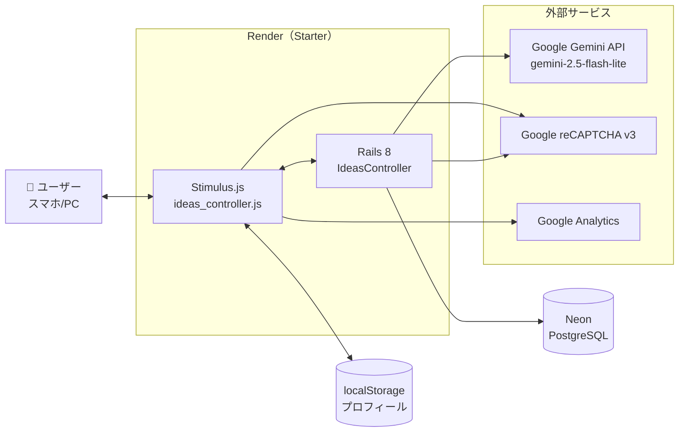
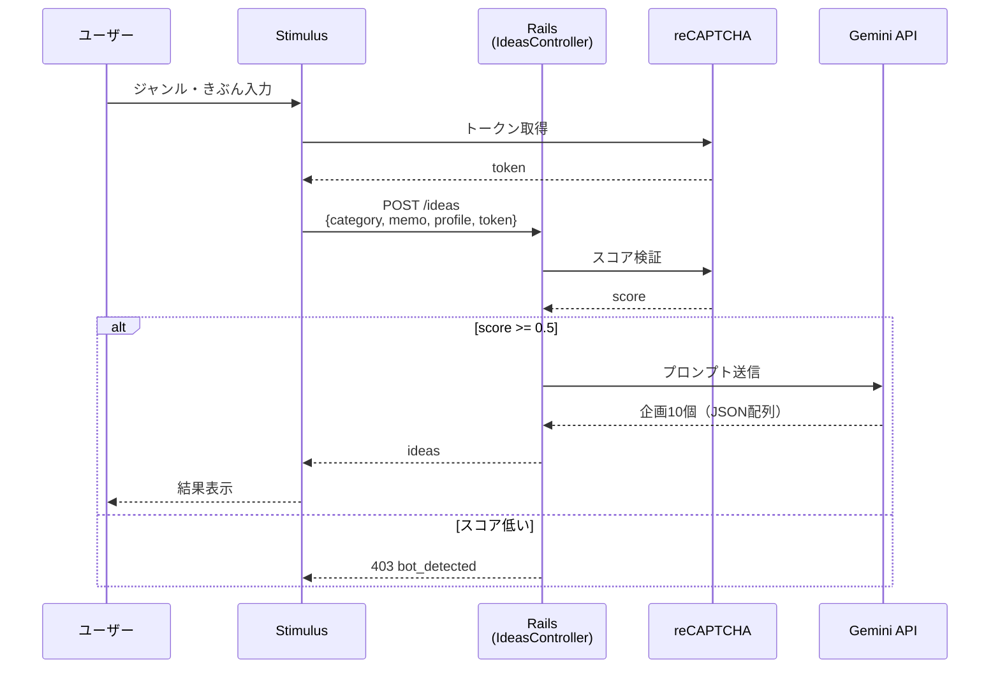
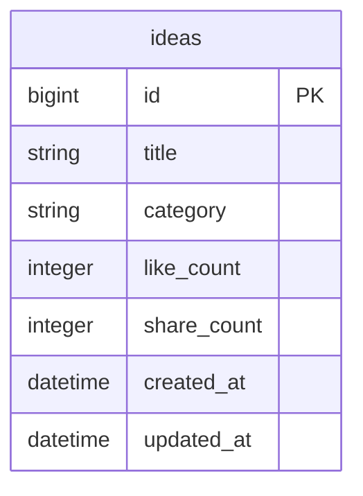

# きかくさん

ライバーのための配信企画ジェネレータ

🔗 https://kikakusan.onrender.com/

## 概要

ジャンル（ざつだん・ゲーム・うた・おまかせ）と今日のきぶんを入力すると、AIが配信企画を10個提案するWebアプリ。プロフィールを登録しておくと、より自分に合った企画が出やすくなる。登録・ログイン不要、スマホで完結。

## システム構成図



## 企画生成の流れ



## 機能

| 機能 | 内容 |
|---|---|
| 企画生成 | ジャンル＋きぶんから配信企画を10個まとめて提案 |
| パーソナライズ | 性別・年齢・家族構成・配信キャラ・リスナー層をプロンプトに反映 |
| プロフィール保存 | ログイン不要。localStorage に保存 |
| コピー | ワンタップで企画タイトルをクリップボードへ |
| Xシェア | 企画タイトルをそのままポストできるリンク |
| いいね・シェア数 | DBに集計（`ideas` テーブル） |

## 技術スタック

| カテゴリ | 技術 | 選定理由 |
|---|---|---|
| バックエンド | Ruby on Rails 8 | 普段業務で触っていて勘が働く |
| フロントエンド | Stimulus.js | Railsデフォルト。SPAにするほどの規模じゃない |
| AI | Google Gemini API | `gem` を入れず `Net::HTTP` 直叩き（依存を増やしたくなかった） |
| モデル | gemini-2.5-flash-lite | 無料枠で回せて十分な品質 |
| セキュリティ | rack-attack / reCAPTCHA v3 | API利用枠を守るため |
| ホスティング | Render（Starter） | そんなにアクセス多くない想定 |
| データベース | Neon（PostgreSQL） | 無料枠で足りる |

## ディレクトリ構成（主要なところだけ）

```
app/
├── controllers/
│   └── ideas_controller.rb   # index / create / like / share
├── services/
│   └── gemini_service.rb     # プロンプト組み立て＆API呼び出し
├── models/
│   └── idea.rb               # title / category / like_count / share_count
├── javascript/controllers/
│   └── ideas_controller.js   # 入力受付・結果描画・localStorage
└── views/ideas/
    ├── index.html.erb
    ├── _home.html.erb
    ├── _result.html.erb
    ├── _profile_edit.html.erb
    ├── _about.html.erb
    ├── _loading.html.erb
    └── _bottom_nav.html.erb
config/
└── initializers/
    └── rack_attack.rb        # レート制限
```

## エンドポイント

| メソッド | パス | 役割 |
|---|---|---|
| GET | `/` | トップ（入力画面） |
| POST | `/ideas` | 企画生成（reCAPTCHA検証 → Gemini呼び出し） |
| POST | `/ideas/like` | いいね数 +1 |
| POST | `/ideas/share` | シェア数 +1 |

## データモデル



ユーザーテーブルは無い。プロフィールはクライアントの localStorage のみ。

## セキュリティ対策

| 対策 | 内容 |
|---|---|
| reCAPTCHA v3 | トークンスコアが 0.5 未満なら 403 |
| rack-attack（分） | 1IP あたり 1分3回まで |
| rack-attack（日） | 1IP あたり 1日50回まで |
| メモ長制限 | `memo` は 100 文字で切り詰め |
| API制限超過時 | 429 を JSON で返す |

## 環境変数

```
GEMINI_API_KEY=
RECAPTCHA_SITE_KEY=
RECAPTCHA_SECRET_KEY=
GA_MEASUREMENT_ID=       # 省略可（未設定時はGAスクリプト読み込みなし）
```

## ローカル起動

```bash
bundle install
rails db:create db:migrate
bin/dev
```

## テスト

```bash
bundle exec rspec
```
